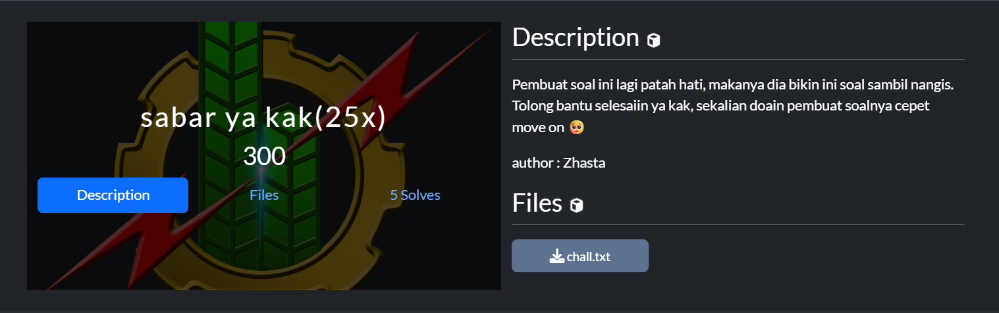
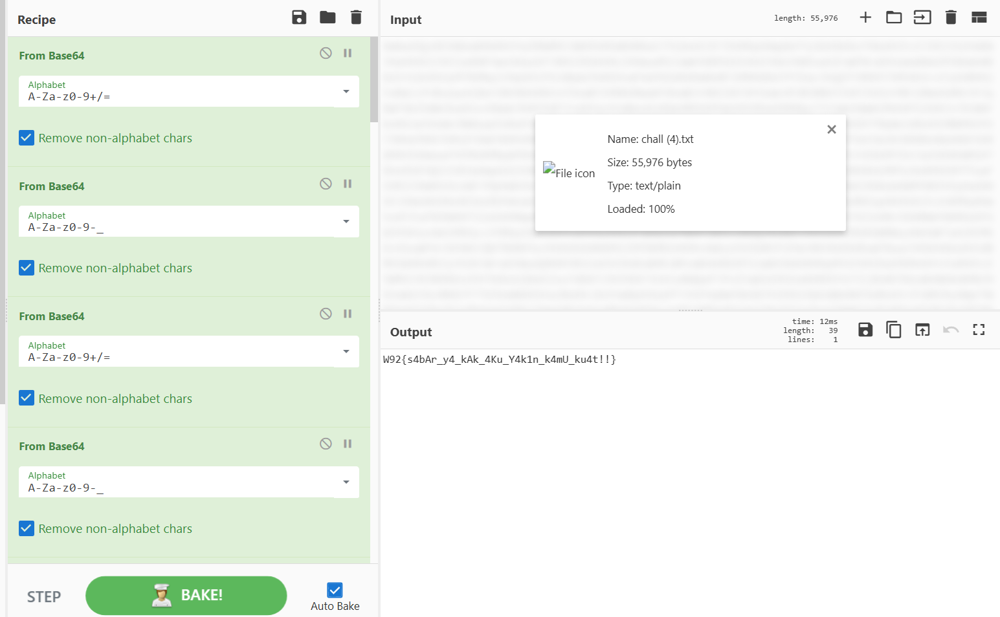

# **Attached**

## sabar ya kak(25x)

Kita diberikan sebuah file txt, file tersebut berisi base64 yang sangat panjang.
kemungkinan base64 yang sudah di encode berkali kali.

## Solution

kita melakukan decode pada file tersebut dengan menggunakan tools [cyberchef](https://cyberchef.io), Soal ini tergolong soal yang sangat mudah jika kita mengetahui metode encoding apa yang telah di jalankan

kita encode sebanyak 25x sesuai clue yang di berikan pada judul..

#### **FLAG : W92{s4bAr_y4_kAk_4Ku_Y4k1n_k4mU_ku4t!!}**

